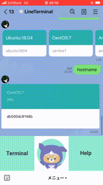

# LineTerminal

# Sample


## Local Settings

### create env file
- see `.env_sample` and create for your settings.

### build and run docker images
- run `docker-compose build`
- run `docker-compose up`

### setup local database
- access from your browser to `http://localhost:50727/` then you can see DynamoDB Admin Tool
- create tables
  - servers
    ```json
    {
        "AttributeDefinitions": [
            {
                "AttributeName": "id",
                "AttributeType": "N"
            }
        ],
        "TableName": "Servers",
        "KeySchema": [
            {
                "AttributeName": "id",
                "KeyType": "HASH"
            }
        ],
        "TableStatus": "ACTIVE",
        "CreationDateTime": "2020-12-13T11:57:19.073Z",
        "ProvisionedThroughput": {
            "LastIncreaseDateTime": "1970-01-01T00:00:00.000Z",
            "LastDecreaseDateTime": "1970-01-01T00:00:00.000Z",
            "NumberOfDecreasesToday": 0,
            "ReadCapacityUnits": 1,
            "WriteCapacityUnits": 1
        },
        "TableSizeBytes": 182,
        "ItemCount": 3,
        "TableArn": "arn:aws:dynamodb:ddblocal:000000000000:table/Servers"
    }
    ```

  - sessions
    ```json
    {
        "AttributeDefinitions": [
            {
                "AttributeName": "id",
                "AttributeType": "S"
            },
            {
                "AttributeName": "user_id",
                "AttributeType": "S"
            }
        ],
        "TableName": "Sessions",
        "KeySchema": [
            {
                "AttributeName": "id",
                "KeyType": "HASH"
            },
            {
                "AttributeName": "user_id",
                "KeyType": "RANGE"
            }
        ],
        "TableStatus": "ACTIVE",
        "CreationDateTime": "2020-12-13T14:01:25.597Z",
        "ProvisionedThroughput": {
            "LastIncreaseDateTime": "1970-01-01T00:00:00.000Z",
            "LastDecreaseDateTime": "1970-01-01T00:00:00.000Z",
            "NumberOfDecreasesToday": 0,
            "ReadCapacityUnits": 1,
            "WriteCapacityUnits": 1
        },
        "TableSizeBytes": 1217,
        "ItemCount": 7,
        "TableArn": "arn:aws:dynamodb:ddblocal:000000000000:table/Sessions",
        "GlobalSecondaryIndexes": [
            {
                "IndexName": "user_id",
                "KeySchema": [
                    {
                        "AttributeName": "user_id",
                        "KeyType": "HASH"
                    }
                ],
                "Projection": {
                    "ProjectionType": "ALL"
                },
            "IndexStatus": "ACTIVE",
            "ProvisionedThroughput": {
                "ReadCapacityUnits": 1,
                "WriteCapacityUnits": 1
            },
            "IndexSizeBytes": 1217,
            "ItemCount": 7,
            "IndexArn": "arn:aws:dynamodb:ddblocal:000000000000:table/Sessions/index/user_id"
            }
        ]
    }
    ```

    - insert servers data (sample data below)
    ```json
    {
        "name": "CentOS:7",
        "hostname": "centos7",
        "password": "password",
        "id": 1,
        "user": "root"
    }
    ```

### access enable via ngrok
- run `ngrok http 500`
- get https Forwarding url and set it to Messaging API Setting in LINE Developers Console